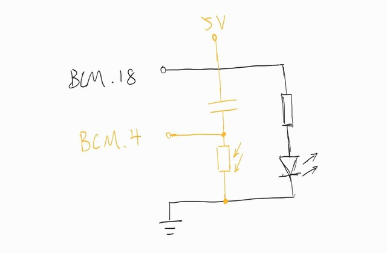
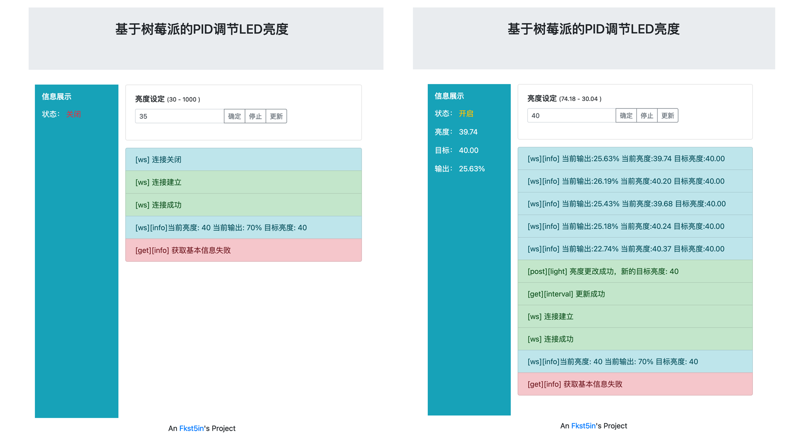

# 树莓派 PID LED自动调光

> 硬件：树莓派3B、led、光敏电阻及电阻电容


### 简介
* 使用

按下图连接外设


```
$ git clone https://github.com/Fkst5in/led.auto.raspberry && cd led.auto.raspberry 
$ sudo apt install  pigpio #安装pigpio
$ pip3 install pigpio Flask gevent gevent-websocket #安装python依赖
$ python3 app.py
```
然后网页上打开 http://树莓派ip地址:9090

* 效果图





### 说明
* LED 控制

使用python pigpio库调用硬件pwm控制led亮度

* 光敏感电阻测光

光敏电阻串联电容形成一个简单的rc震荡器，而在不同光照下光敏电阻的电阻值的变化便可通过测量震荡周期大致得出

* PID控制

```
# 比例项
PTerm = error * Kp 
# 积分项
ITerm += error * delta_time
# 微分项
DTerm = delta_error / delta_time

output = PTerm + (Ki * ITerm) + (Kd * DTerm)
```

* 服务端

使用flask web框架实现控制接口、使用gevent-websocket及monkey实现websocket通信、使用ThreadPoolExecutor 开启pid控制的协程

* 控制端

使用 [vue]()、[axios]()、[bootstrap]()构建的一个简单页面


